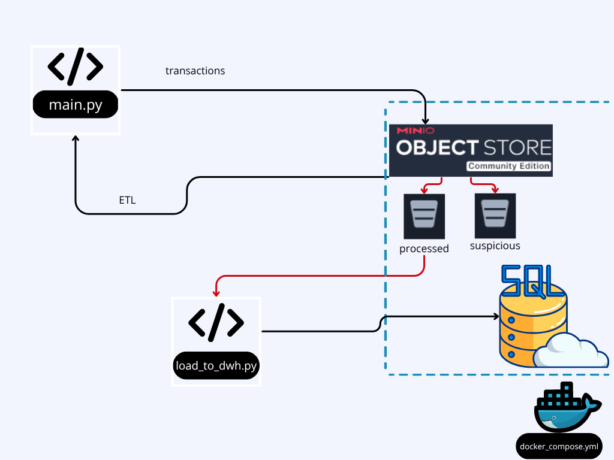
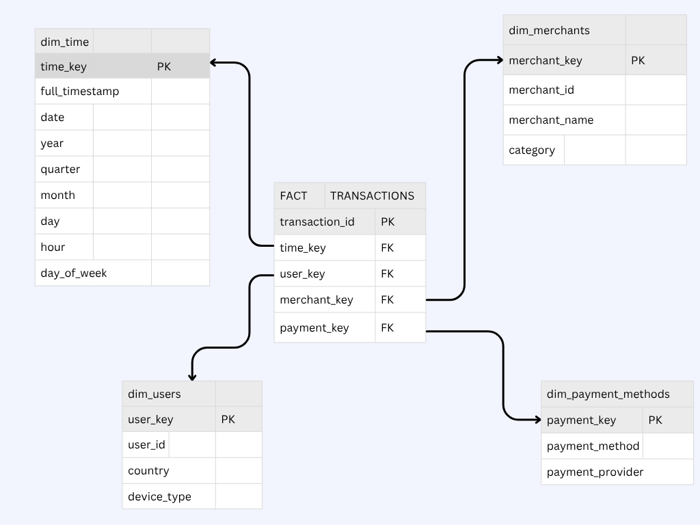

# Prueba Técnica - Data Engineer (Fintech)


## Resumen del Proyecto

Este repositorio contiene la solución a la prueba técnica de Data Engineer. El proyecto implementa un **pipeline de datos end-to-end** que simula el procesamiento de transacciones de pago de una fintech.

El sistema completo está orquestado con **Docker Compose** y sigue el siguiente flujo:



1. Un script de Python (`main.py`) genera transacciones y las ingiere en un **Data Lake S3 (MinIO)**.
2. El mismo script procesa los datos crudos del Data Lake: los limpia, valida y aplica reglas de negocio para **detectar fraudes**.
3. Los datos limpios (`processed`) y los fraudulentos (`suspicious`) se guardan en *buckets* separados dentro del mismo Data Lake (MinIO).
4. Un segundo script (`load_to_dwh.py`) toma los datos limpios (`processed`) y los carga en un **Data Warehouse (PostgreSQL)**, el cual sigue un modelo dimensional de **Esquema Estrella** para facilitar el análisis.

---

## 1. Arquitectura de la Solución

El diseño prioriza la **escalabilidad** y el **desacoplamiento**, utilizando un Data Lake (MinIO) como almacenamiento intermedio, lo que permite que los procesos de ingesta y carga al DWH operen de forma independiente.

---

## 2. Fases Completadas y Decisiones Estratégicas

El desafío principal de esta prueba era la **gestión del tiempo** y la **priorización estratégica**, dado que fue diseñada para no ser completada en su totalidad. Mi enfoque fue construir un *pipeline* robusto y profesional de las Fases 1 a 3, demostrando excelencia en las competencias clave solicitadas.

### ✅ Fase 1: Data Lake - Ingesta de Datos (Completada con Puntos Extra)

- **Tarea:** Configurar el almacenamiento de datos crudos.
- **Implementación:** Se implementó el **Punto Extra** de utilizar **MinIO** (un servicio de almacenamiento de objetos compatible con S3) como Data Lake local.
- **Justificación:** El uso de un Data Lake S3 en lugar de una carpeta local es una práctica estándar de la industria. Demuestra capacidad para trabajar con infraestructura de nube y permite que el sistema sea más escalable y desacoplado. Todo el pipeline (generación, lectura y escritura) opera contra la API de MinIO.

### ✅ Fase 2: ETL Pipeline - Limpieza y Detección de Fraude (Completada)

- **Tarea:** Implementar las funciones `clean_data()` y `detect_suspicious_transactions()` en `main.py`.
- **Implementación:** Ambas funciones fueron implementadas exitosamente. El proceso de desarrollo y las decisiones de limpieza se documentaron en el notebook `EDA_Limpieza_Fraude.ipynb`.

**Detalle de `clean_data()`:**
1. **Valores Nulos:** Se rellenaron `three_ds_verified` (con `False`) e `ip_address` (con `'Unknown'`). `settlement_date` se deja como nulo (`NaT`) para transacciones declinadas.
2. **Duplicados:** Se eliminaron duplicados basados en `transaction_id`.
3. **Tipos de Datos:** Se forzaron los tipos correctos (`datetime`, `boolean`, `numeric`).
4. **Outliers:** Se manejaron *outliers* de datos erróneos (ej. `amount` negativos) usando `.abs()`, sin eliminar *outliers* de fraude (ej. montos altos) que son útiles para la detección.
5. **Estandarización:** Se normalizaron campos de texto (mayúsculas/minúsculas) para consistencia.

**Detalle de `detect_suspicious_transactions()`:**
1. **Montos Altos:** Se marcan transacciones que superan un umbral (`AMOUNT_THRESHOLD`).
2. **Intentos Fallidos:** Se marcan transacciones con más de 3 intentos (`ATTEMPT_THRESHOLD`).
3. **Declinadas por Seguridad:** Se marcan transacciones declinadas que contienen *keywords* de fraude (ej. `security`, `stolen`).
4. **Patrones Anómalos:** Se implementó una regla para detectar "alta frecuencia", marcando a usuarios que realizan más de 5 transacciones en un solo lote de 1 minuto.

**Decisión Estratégica (Puntos Extra Omitidos):**
- Se omitió la **API de *currencies***, ya que introduce un punto de fallo externo (la API), latencia de red y complejidad de manejo de errores, lo cual es riesgoso para un pipeline "en tiempo real".
- Se omitió la orquestación con **Apache Airflow**, ya que configurarlo es un proyecto en sí mismo y representa la "trampa de tiempo" mencionada en las instrucciones. Prioricé entregar un DWH funcional (Fase 3) sobre un orquestador (Fase 2 Extra).

### ✅ Fase 3: Data Warehouse - Modelado y Almacenamiento (Completada con Puntos Extra)

- **Tarea:** Diseñar e implementar un modelo dimensional y cargar los datos en PostgreSQL.
- **Implementación:** Se completó la fase, incluyendo el **Punto Extra** de **dockerizar PostgreSQL**.

1. **Infraestructura:** Se creó un archivo `docker-compose.yml` que levanta tanto `PostgreSQL` como `MinIO`, permitiendo que toda la infraestructura del proyecto se inicie con un solo comando.
2. **Diseño del Esquema:** Se diseñó un **Esquema Estrella** (detallado abajo) con una tabla de hechos (`fact_transactions`) y 4 dimensiones (`dim_time`, `dim_users`, `dim_merchants`, `dim_payment_methods`).
3. **Script de Carga (`load_to_dwh.py`):** Se creó un script ETL dedicado que lee los archivos limpios del *bucket* `processed` de MinIO, transforma los datos para que coincidan con el Esquema Estrella (mapeando IDs de negocio a *surrogate keys*) y los carga en PostgreSQL.
4. **Idempotencia:** La carga se realiza mediante una función `UPSERT` (`INSERT ... ON CONFLICT DO NOTHING`), lo que asegura que el script de carga se pueda ejecutar múltiples veces sin duplicar datos en el DWH.

---

## 3. Diseño del Data Warehouse (Esquema Estrella)



### `fact_transactions` (Tabla de Hechos)

| Columna | Tipo de Dato | Descripción / Clave |
|:---|:---|:---|
| **`transaction_id`** | `VARCHAR(50)` | **PK (Clave Primaria)** / Dimensión Degenerada |
| **`time_key`** | `INTEGER` | **FK (Clave Foránea)** → `dim_time` |
| **`user_key`** | `INTEGER` | **FK (Clave Foránea)** → `dim_users` |
| **`merchant_key`** | `INTEGER` | **FK (Clave Foránea)** → `dim_merchants` |
| **`payment_method_key`** | `INTEGER` | **FK (Clave Foránea)** → `dim_payment_methods` |
| `amount` | `NUMERIC(10, 2)` | **Métrica** (Monto total) |
| `transaction_fee` | `NUMERIC(10, 2)` | **Métrica** (Comisión) |
| `net_amount` | `NUMERIC(10, 2)` | **Métrica** (Monto neto) |
| `installments` | `INTEGER` | **Métrica** (Cuotas) |
| `processing_time_ms` | `INTEGER` | **Métrica** (Tiempo de proceso) |
| `attempt_number` | `INTEGER` | **Métrica** (Intentos) |
| `status` | `VARCHAR(50)` | Dimensión Degenerada |
| `response_code` | `VARCHAR(10)` | Dimensión Degenerada |
| `is_international` | `BOOLEAN` | Dimensión Degenerada |
| `response_message` | `VARCHAR(255)` | Dimensión Degenerada |

### `dim_time` (Dimensión de Tiempo)

| Columna | Tipo de Dato | Descripción / Clave |
|:---|:---|:---|
| **`time_key`** | `INTEGER` | **PK (Clave Primaria)** (Ej: `2025102618`) |
| `full_timestamp` | `TIMESTAMP` | Fecha y hora completas |
| `date` | `DATE` | Solo la fecha |
| `year` | `INTEGER` | Año (Ej: `2025`) |
| `quarter` | `INTEGER` | Trimestre (Ej: `4`) |
| `month` | `INTEGER` | Mes (Ej: `10`) |
| `day` | `INTEGER` | Día (Ej: `26`) |
| `hour` | `INTEGER` | Hora (Ej: `18`) |
| `day_of_week` | `INTEGER` | Día de la semana (0=Lunes, 6=Domingo) |

### `dim_users` (Dimensión de Usuarios)

| Columna | Tipo de Dato | Descripción / Clave |
|:---|:---|:---|
| **`user_key`** | `SERIAL` | **PK (Clave Primaria)** (Autoincremental) |
| `user_id` | `INTEGER` | **Clave de Negocio** (Ej: `6719`) (UNIQUE) |
| `country` | `VARCHAR(5)` | País del usuario (Ej: `CL`) |
| `device_type` | `VARCHAR(50)` | Dispositivo (Ej: `mobile`) |

### `dim_merchants` (Dimensión de Comercios)

| Columna | Tipo de Dato | Descripción / Clave |
|:---|:---|:---|
| **`merchant_key`** | `SERIAL` | **PK (Clave Primaria)** (Autoincremental) |
| `merchant_id` | `INTEGER` | **Clave de Negocio** (Ej: `735`) (UNIQUE) |
| `merchant_name` | `VARCHAR(255)` | Nombre (Cargado como Nulo) |
| `category` | `VARCHAR(100)` | Categoría (Ej: `retail`) |

### `dim_payment_methods` (Dimensión de Métodos de Pago)

| Columna | Tipo de Dato | Descripción / Clave |
|:---|:---|:---|
| **`payment_method_key`** | `SERIAL` | **PK (Clave Primaria)** (Autoincremental) |
| `payment_method` | `VARCHAR(100)` | Método (Ej: `debit_card`) |
| `payment_provider` | `VARCHAR(100)` | Proveedor (Ej: `Visa Debit`) |
| *(Constraint)* | | `UNIQUE(payment_method, payment_provider)` |

---

## 4. Fase 4: Procesamiento en Tiempo Real (Diseño Documentado)

Como se solicitó, esta fase no se implementó para priorizar las Fases 1-3. Sin embargo, aquí se presenta el diseño técnico de cómo se implementaría un sistema de alertas de fraude en tiempo real usando **Apache Kafka**.

1. **Infraestructura:** Se añadirían dos nuevos servicios al archivo `docker-compose.yml`: `kafka-broker` y `zookeeper` (su gestor de configuración).

2. **Productor (Producer):** Se modificaría el script `main.py`. Específicamente, la función `detect_suspicious_transactions`. Cuando esta función genera el `df_suspicious`, iteraría sobre cada fila y publicaría un mensaje (en formato JSON) en un *topic* de Kafka llamado `suspicious_transactions`.

3. **Consumidor (Consumer):** Se crearía un nuevo script (`kafka_consumer.py`). Este sería un servicio de larga duración (correría 24/7) suscrito al *topic* `suspicious_transactions`. En cuanto un mensaje de fraude es publicado por el productor, el consumidor lo leería en milisegundos y ejecutaría una acción (ej. imprimir una alerta en consola, enviar un email o registrar la métrica en un dashboard).

4. **Justificación:** Kafka es la herramienta ideal para este caso de uso de detección de fraude. Su arquitectura de "publicación/suscripción" **desacopla** el pipeline: el `main.py` (Productor) no necesita saber *quién* va a leer la alerta, solo la "grita" al *topic*. Múltiples servicios (Consumidores) pueden escuchar ese mismo *topic* para diferentes propósitos (alertas, métricas, dashboards) sin afectar el rendimiento del pipeline principal.

---

## 5. Cómo Ejecutar la Solución

### Prerrequisitos

- [Git](https://git-scm.com/downloads)
- [Python 3.10+](https://www.python.org/downloads/)
- [Docker Desktop](https://www.docker.com/products/docker-desktop/) (Es **fundamental** que esté instalado y corriendo)

### Instrucciones de Setup

1. **Clonar el repositorio:**
```bash
git clone https://github.com/LacavaLorenzo/CodeableLabs-ET.git
cd CodeableLabs-ET
```

2. **Crear y activar el entorno virtual:**
```bash
python -m venv venv

# En Windows (Git Bash)
source venv/Scripts/activate

# En Windows (PowerShell)
.\venv\Scripts\activate
```

3. **Instalar dependencias:**
```bash
pip install -r requirements.txt
```

4. **Levantar la Infraestructura (Postgres & MinIO) 🚀:**

*Este es el paso más importante. Levanta la base de datos y el Data Lake.*
```bash
docker-compose up -d
```

### Verificación de Infraestructura

- Para confirmar que los servicios están corriendo, ejecuta `docker ps`. Deberías ver `fintech_postgres` y `fintech_minio` en estado "Up".
- Puedes acceder a la consola web de MinIO (el Data Lake) en tu navegador:
  - **URL:** `http://localhost:9001`
  - **User:** `minioadmin`
  - **Password:** `minioadminpassword`

### Ejecución del Pipeline

Se recomienda abrir dos terminales separadas (ambas con el `venv` activado).

**Terminal 1: Pipeline de Ingesta (Simulación Real-Time)**

*Este script corre en un bucle infinito, generando datos cada 60 segundos.*
```bash
python main.py
```

- **Qué está haciendo:** Genera 100 transacciones, las guarda en S3 (`transactions`), las lee de S3, las procesa (limpia y detecta fraude) y guarda los resultados en S3 (`processed` y `suspicious`).
- **Puedes ver** los archivos CSV aparecer en tiempo real en los *buckets* de MinIO (`http://localhost:9001`).

**Terminal 2: Carga al Data Warehouse (Batch ETL)**

*Este script corre una sola vez y procesa todos los archivos "limpios" que encuentre.*
```bash
python load_to_dwh.py
```

- **Qué está haciendo:** Lee todos los archivos CSV del *bucket* `processed` de MinIO, los transforma al Esquema Estrella y los carga en la base de datos PostgreSQL.
- **Es idempotente:** Puedes ejecutarlo cuantas veces quieras. Gracias a la lógica `ON CONFLICT`, no se crearán datos duplicados.

### Verificación de Datos en el DWH

Para confirmar que los datos se cargaron, puedes usar cualquier cliente de base de datos (como DBeaver, DataGrip o pgAdmin) y conectarte a la base de datos de PostgreSQL con estas credenciales:

- **Host:** `localhost`
- **Puerto:** `5432`
- **Base de datos:** `fintech_db`
- **Usuario:** `user`
- **Contraseña:** `password`

Puedes ejecutar `SELECT COUNT(*) FROM fact_transactions;` para ver los datos cargados.

---

## 6. Estructura del Repositorio
```
.
├── .gitignore
├── stepbystep/ 
        └── 1_EDA.ypnbEDA_Limpieza_Fraude.ipynb   # Notebooks con el análisis exploratorio 
        └── 2_PostgreSQL.ipynb                    # y diseño de lógica
├── README.md                   # Este archivo
├── arquitectura.png            # Diagrama de flujo del pipeline
├── docker-compose.yml          # Archivo de infraestructura (Postgres & MinIO)
├── load_to_dwh.py              # Script ETL de MinIO a PostgreSQL (Fase 3)
├── main.py                     # Script principal de ingesta y procesamiento (Fases 1 & 2)
├── requirements.txt            # Dependencias de Python
├── data/                       # Datos CSV originales (no usados por el pipeline final)
├── scripts/                    # Scripts de generación de datos de Python
├── suspicious/                 # (Ignorado por Git) Carpeta local (no usada)
└── transactions/               # (Ignorado por Git) Carpeta local (no usada)
```

---

## 7. Conclusiones y Aprendizajes

Este proyecto demuestra:

- ✅ Capacidad de diseñar arquitecturas de datos escalables y desacopladas
- ✅ Experiencia con herramientas modernas de la industria (MinIO/S3, PostgreSQL, Docker)
- ✅ Implementación de modelos dimensionales (Star Schema) para análisis
- ✅ Desarrollo de lógica ETL robusta con validaciones y detección de anomalías
- ✅ Gestión estratégica del tiempo y priorización de tareas críticas
- ✅ Documentación clara y profesional del trabajo realizado

La decisión de priorizar un pipeline completo y funcional (Fases 1-3) sobre características adicionales (API de currencies, Airflow, Kafka) refleja un enfoque pragmático orientado a entregar valor de negocio real.
